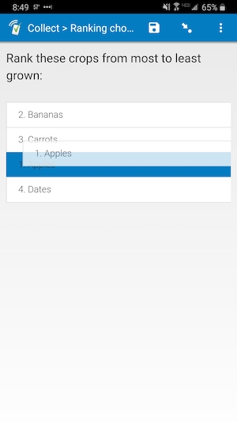
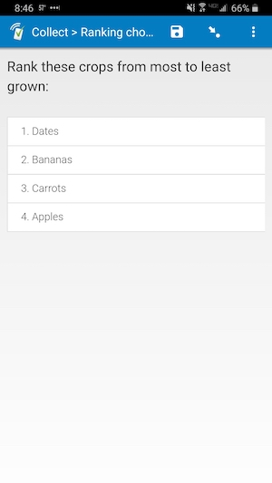

# Ranking choices

||||
|:---:|:---:|:---:|
|Moving|Ranked|No numbers|

## Description

*Requires at least Android 7 or iOS 13 to work on SurveyCTO Collect.*

Use this field plug-in so enumerators can drag to rank choices. Define your choices like you usually would, attach this field plug-in, and you're all set!

### Features

* Ranking choices of a *select_multiple* field using drag-and-drop
* Auto-numbering of choices when specified (see [Parameters](#parameters))
* Re-numbering as choices are moved
* Can specify if at least once change needs to be made before continuing to the next field (see [Parameters](#parameters))

This field plug-in also inherits functionality from the [baseline-select_multiple](https://github.com/surveycto/baseline-select_multiple) field plug-in.

### Data format

This field will return a space-separated list of all choices in the order they were ranked. For example, if the choice values are 1, 2, 3, and 4, and they are ranked 3, 2, 4, then 1, then the field would have this value:

    3 2 4 1

You can use the [selected-at()](https://docs.surveycto.com/02-designing-forms/01-core-concepts/09.expressions.html#Help_Forms_selected-at) function to retrieve each rank. For example, if the field is called "ranking", you can use the expression `selected-at(${ranking}, 0)` to retrieve the value of the choice ranked number 1, `selected-at(${ranking}, 1)` to retrieve the value of the choice ranked number 2, and so on.

## How to use

### Getting started

**To use this field plug-in as-is:**

1. Download the [sample form](https://github.com/surveycto/ranking-choices/raw/master/extras/sample-form/Ranking%20choices.xlsx) from this repo and upload it to your SurveyCTO server.
1. Download the [rankingchoices.fieldplugin.zip](https://github.com/surveycto/ranking-choices/raw/master/rankingchoices.fieldplugin.zip) file from this repo, and attach it to the sample form on your SurveyCTO server.
1. Adjust the parameter if you would like to use a different unit (see below).

### Parameters

|Name|Description|Default|
|---|---|---|
|`allowdef` (optional)|Whether to allow the default display without making changes|0|
|`numbers` (optional)|Whether to number the rankings of each choice|1|

There are two parameters, both of which are optional:

`alloqdef`: If this parameter has a value of 1, then the enumerator can swipe to the next field without making any changes. If the parameter is any other value, or it is not included, at least one change needs to occur. This change can be as simple as tapping a choice so it stays in the same place.  
`numbers`:  If this parameter has a value of 1, or if it is not included, then choices will have numbers ranking them from 1 to x (x being the number of choices). The numbers will stay in order even as the choices are moved around. If the parameter has a value of 0, then these numbers will not be shown.

### Default SurveyCTO feature support

| Feature / Property | Support |
| --- | --- |
| Supported field type(s) | `select_multiple`|
| Default values | Yes |
| Custom constraint message | Yes |
| Custom required message | Yes |
| Read only | Yes |
| media:image | Yes (not in choices) |
| media:audio | Yes  (not in choices) |
| media:video | Yes (not in choices) |
| `minimal` appearance | No |
| `compact` appearance | No |
| `compact-#` appearance | No |
| `randomized` appearance | Yes |

## More resources

* **Sample form**  
You can find a form definition in this repo here: [extras/sample-form](extras/sample-form).

* **Developer documentation**  
More instructions for developing and using field plug-ins can be found here: [https://github.com/surveycto/Field-plug-in-resources](https://github.com/surveycto/Field-plug-in-resources)
